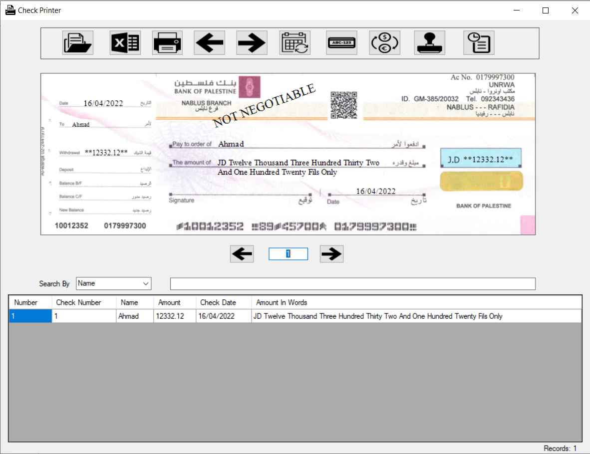
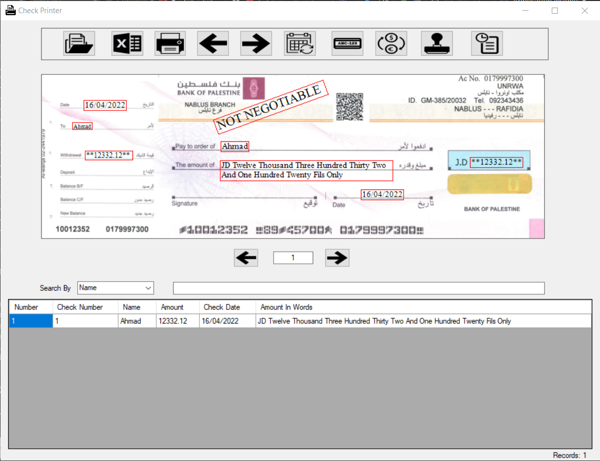

# Printing on Pre-Printed Checks
Windows Forms application that aims to automate the process of hand writing on a pre-printed checks.
   Instead you can import an excel sheet with the names and the amounts, then the program generates the amount in word and print all info needed on the pre-printed check. 
   You can also recalibrate the where values are printed using drag and drop of the shown value.
## Some Other Feautres:
- Keep the history of the printed checks with the date of printing.
- Export imported names to another excel sheet that contains serial numbers.
- Use different currencies such as : USD, JOD and NIS

# Screenshots:

Red boxes shows the painted info on top of an image of pre-printed check

